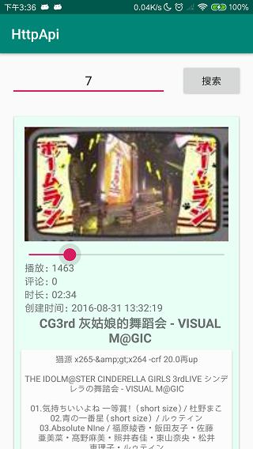

# 中山大学数据科学与计算机学院本科生实验报告

## （2018年秋季学期）

| 课程名称 | 手机平台应用开发 | 任课老师 | 郑贵锋 |
| :------------: | :-------------: | :------------: | :-------------: |
| 年级 | 2016级  | 专业（方向） |  计算机应用 |
| 学号 | 16340030 | 姓名 | 陈斯敏 |
| 电话 | 15917173057 | Email | 2540740154@qq.com |
| 开始日期 | 2018.12.10 | 完成日期 | 2018.12.12

---

## 一、实验题目

### **个人项目5**

### **WEB API**

#### 第十四周任务: **WEB API**

---

## 二、实验目的

### 1. 学会使用HttpURLConnection请求访问Web服务
### 2. 学习Android线程机制，学会线程更新UI
### 3. 学会解析JSON数据
### 4. 学习CardView布局技术。

---

## 三、实现内容

### 实验内容
#### 要求  
#### 实现一个bilibili的用户视频信息获取软件
<table>
    <tr>
        <td >打开程序主页面</td>
        <td >输入用户id，要求正整数int类型，不满足的弹Toast提示即可</td>
    </tr>
    <tr>
        <td >输入用户id，点击搜索，网络没打开则弹Toast提示网络连接失败</td>
        <td >网络打开情况下，输入用户id，不存在相应数据的弹Toast提示</td>
    </tr>
    <tr>
        <td >输入用户id = 2，点击搜索，展示图片/播放数/评论/时长/创建时间/标题/简介内容</td>
        <td >再次输入用户id = 7，接着上次结果继续展示以上内容</td>
    </tr>
</table>

* 搜索框只允许正整数int类型，不符合的需要弹Toast提示
*  当手机处于飞行模式或关闭wifi和移动数据的网络连接时，需要弹Toast提示
*  由于bilibili的API返回状态有很多，这次我们特别的限制在以下几点
    * 基础信息API接口为： `https://space.bilibili.com/ajax/top/showTop?mid=<user_id>`
    * 图片信息API接口为基础信息API返回的URL，cover字段
    * 只针对前40的用户id进行处理，即`user_id <= 40`
    * [2,7,10,19,20,24,32]都存在数据，需要正确显示
* **在图片加载出来前需要有一个加载条，不要求与加载进度同步**
* 布局和样式没有强制要求，只需要展示图片/播放数/评论/时长/创建时间/标题/简介的内容即可，可以自由发挥
* **布局需要使用到CardView和RecyclerView**
* 每个item最少使用2个CardView，布局怎样好看可以自由发挥，不发挥也行
* 不完成加分项的同学可以不显示SeekBar
* 输入框以及按钮需要一直处于顶部

---
### 验收内容
1. 图片/播放数/评论/时长/创建时间/标题/简介 显示是否齐全正确，
2. 是否存在加载条
3. Toast信息是否准确，特别地，针对用户网络连接状态和数据不存在情况的Toast要有区别
4. 多次搜索时是否正常
5. 代码+实验报告
6. 好看的界面会酌情加分，不要弄得像demo那么丑= =

---
### 加分项
<table>
    <tr>
        <td >拖动SeekBar，显示相应位置的预览图</td>
        <td >拖动SeekBar，显示相应位置的预览图</td>
    </tr>
</table>

* 拖动前后均显示原图片
* 模拟bilibili网页PC端，完成可拖动的预览功能
* 拖动seekBar，预览图会相应改变
* 前40的用户id中，32不存在预览图，可以忽略也可以跟demo一样将seekbar的enable设置为false
* 需要额外使用两个API接口，分别为
    * 利用之前API获得的信息，得到aid传入`https://api.bilibili.com/pvideo?aid=<aid>`
    * 利用`api.bilibili.com`得到的信息，解析image字段得到`"http://i3.hdslb.com/bfs/videoshot/3668745.jpg` 的图片
    * 分割该图片即可完成预览功能
* 加分项存在一定难度，需要不少额外编码，**可不做**。
* 32不存在预览图，可忽略或处理该异常情况 

---

## 四、实验结果

### (1) 实验截图
* 打开程序主页面：
  
  

* 输入的用户ID不满足要求，弹出提示：

  

* 网络未连接或者失败情况下弹出提示：

  

* 输入不存在记录的用户户名弹出提示：

  

* 输入用户id = 2，点击搜索，展示图片/播放数/评论/时长/创建时间/标题/简介内容：

  

* 再次输入用户id = 7，接着上次结果继续展示以上内容：
  
  

* 加分项完成截图如下，拖动SeekBar，显示相应位置的预览图：
  <table>
    <tr>
        <td >拖动SeekBar，显示相应位置的预览图</td>
        <td >拖动SeekBar，显示相应位置的预览图</td>
    </tr>
  </table>


### (2) 实验步骤以及关键代码
* 首先，因为需要使用相应的布局控件CardView和RecyclerView，我们需要在build.gradle中引入相应的包：
  ```c
    implementation 'com.android.support:cardview-v7:28.+'
    implementation 'com.android.support:recyclerview-v7:28.0.0'
  ```
* 因为我们此次需要进行网络访问，所以需要给定app相应的权限(这里的user-permission-sdk-23是因为我使用的手机安卓版本问题，需要相应权限)：
  ```xml
    <uses-permission android:name="android.permission.INTERNET"/>
    <uses-permission-sdk-23 android:name="android.permission.INTERNET"/>
    <uses-permission android:name="android.permission.CHANGE_NETWORK_STATE"/>
    <uses-permission-sdk-23 android:name="android.permission.CHANGE_NETWORK_STATE"/>
  ```
* 实现主页面（登录界面）的页面布局文件 activity_main.xml，该页面并不复杂，主要由一个输入框，一个搜索按钮，以及一个RecyclerView组成的，这里我使用线性布局将它们包起来，然后设置RecyclerView的layout_weight为1，实现占据相应剩余布局
  ```xml
    ···
    <android.support.v7.widget.RecyclerView
        android:id="@+id/recyclerView"
        android:layout_weight="1"
        android:layout_width="match_parent"
        android:layout_height="wrap_content"/>
    ···
  ```
* 实现每个RecyclerView的item的布局，这里使用了CardView，以下给出内容简介部分的CardView实现部分：
  ```xml
    ···
    <android.support.v7.widget.CardView
        android:layout_margin="5dp"
        app:cardBackgroundColor="#FCFCFC"
        android:layout_width="match_parent"
        android:layout_height="wrap_content">
        <LinearLayout
            android:padding="5dp"
            android:layout_width="match_parent"
            android:layout_height="wrap_content">
            <TextView
                android:id="@+id/content"
                android:textSize="12dp"
                android:layout_gravity="center"
                android:textAlignment="center"
                android:layout_width="match_parent"
                android:layout_height="wrap_content" />
        </LinearLayout>
    </android.support.v7.widget.CardView>
    ···
  ```
* 接下来是代码实现部分，首先我们实现了一个用来存放网络返回json的一个数据类RecyclerObj：
  ```java
    public class RecyclerObj {
        private Boolean status;
        private Data data;
        public List<Bitmap> BitmapList = null;
        public static class Data  {
            public int aid;
            public int state;
            public String cover;
            public String title;
            public String content;
            public int play;
            public String duration;
            public int video_review;
            public String create;
            public String rec;
            public int count;
            //省略get set等
        }
        //省略get set等
    }
  ```
* 同时，在完成加分项时，我们需要再次发送请求得到一个新的结构的的json，所以我又实现了一个新的类PvideoObj:
  ```java
  public class PvideoObj {
    public int code;
    public String message;
    public int ttl;
    private Data data;
    public static class Data {
        public String pvdata;
        public int img_x_len;
        public int img_y_len;
        public int img_x_size;
        public int img_y_size;
        public List<String> image;
        public int[] index;
        //省略get set等
    }
    //省略get set等
  }
  ```
* 然后，我们需要实现RecyclerView的适配器类MyRecyclerViewAdapter，同时还需要实现一个item的ViewHolder，该部分实现与PersonalProject1的视品列表相似，此处不进行赘述。
* 在MainActivity中，我们需要绑定该RecyclerView和其适配器，同时，重写适配器的convert函数:
  ```java
    final MyRecyclerViewAdapter myRecyclerViewAdapter = 
        new MyRecyclerViewAdapter<RecyclerObj>(MainActivity.this, R.layout.item, new ArrayList<RecyclerObj>()) {
        @Override
        public void convert(MyViewHolder holder, RecyclerObj recyclerObj) {
            ((TextView)holder.getView(R.id.play_times)).setText("播放："+recyclerObj.getData().play);
            ((TextView)holder.getView(R.id.comment_num)).setText("评论："+recyclerObj.getData().video_review);
            ((TextView)holder.getView(R.id.duration)).setText("时长：" + recyclerObj.getData().duration);
            ((TextView)holder.getView(R.id.create_at)).setText("创建时间：" + recyclerObj.getData().create);
            ((TextView)holder.getView(R.id.title)).setText(recyclerObj.getData().title);
            ((TextView)holder.getView(R.id.content)).setText(recyclerObj.getData().content);
            getOriginBitmapByUrl(holder, recyclerObj);
            getPvideoBimapByUrl(holder, recyclerObj);
            setSeekBar(holder, recyclerObj);
        }
    };
    ...
    RecyclerView recyclerView = findViewById(R.id.recyclerView);
    recyclerView.setLayoutManager(new LinearLayoutManager(this));
    recyclerView.setAdapter(myRecyclerViewAdapter);
  ```

* 上面convert函数中，有三个比较重要的函数，分别是：
    * getOriginBitmapByUrl:获取封面图片
    * getPvideoBimapByUrl：获取预览图列表
    * setSeekBar：设置滑动条事件
  
  首先是getOriginBitmapByUrl的实现，此处我使用的是Handler进行更新UI，在该函数中，新开一个线程进行封面图片的网络获取，然后，如果获取成功，则Handler直接post一个Runnable进行更新UI,如果网络连接异常，则send一个message给Handler，进行相应的提示异常：
  ```java
    private Handler mHandler = new Handler(new Handler.Callback() {
        @Override
        public boolean handleMessage(Message msg) {
            switch (msg.what) {
                case -1:
                    Toast.makeText(context, "网络连接失败", Toast.LENGTH_SHORT).show();
                    break;
                default:
                    break;
            }
            return false;
        }
    });

    public void getOriginBitmapByUrl(final MyViewHolder viewHolder, final RecyclerObj recyclerObj) {
        new Thread(new Runnable() {
            @Override
            public void run() {
                try {
                    URL url = new URL(recyclerObj.getData().cover);
                    HttpURLConnection conn = (HttpURLConnection) url.openConnection();
                    conn.setConnectTimeout(5000);
                    conn.setRequestMethod("GET");
                    if (conn.getResponseCode() == 200) {
                        InputStream inputStream = conn.getInputStream();
                        final Bitmap bitmap = BitmapFactory.decodeStream(inputStream);
                        // 更新封面图片，隐藏progressBar;
                        mHandler.post(new Runnable() {
                            @Override
                            public void run() {
                                ((ImageView)viewHolder.getView(R.id.image)).setImageBitmap(bitmap);
                                viewHolder.getView(R.id.progress_bar).setVisibility(View.GONE);
                                viewHolder.getView(R.id.image).setVisibility(View.VISIBLE);
                            }
                        });
                    }
                } catch (IOException e) {
                    e.printStackTrace();
                    Message msg = new Message();
                    msg.what = -1;
                    mHandler.sendMessage(msg);
                }
            }
        }).start();
    }
  ```
  然后是getPvideoBimapByUrl的实现，这里需要进行两次网络访问，所以为了不每次变换seekBar都重新获取一次，这里我是在一开始就加载并缓存所有的预览图（存成数组），放在recyclerObj中，然后后边seekBar变换时便从中取出相应的预览图片更新UI：
  ```java
  public void getPvideoBimapByUrl(final MyViewHolder viewHolder, final RecyclerObj recyclerObj) {
    new Thread(new Runnable() {
        @Override
        public void run() {
            try {
                int aid = recyclerObj.getData().aid;
                URL url = new URL("https://api.bilibili.com/pvideo?aid="+aid);
                HttpURLConnection connection = (HttpURLConnection) url.openConnection();
                connection.setRequestMethod("GET");//设置HTTP请求方式为GET
                connection.setConnectTimeout(1000);//设置连接超时的毫秒数
                connection.setReadTimeout(1000);//设置读取超时的毫秒数

                if (connection.getResponseCode() == HttpURLConnection.HTTP_OK) {
                    InputStream in = connection.getInputStream();
                    //下面对获取到的输入流进行读取
                    BufferedReader reader = new BufferedReader(new InputStreamReader(in));

                    StringBuilder stringBuilder = new StringBuilder();
                    String line;
                    while ((line = reader.readLine()) != null) {
                        stringBuilder.append(line);
                    }
                    String response = URLDecoder.decode(stringBuilder.toString());
                    final PvideoObj pvideoObj = new Gson().fromJson(response, PvideoObj.class);

                    URL pv_url = new URL(pvideoObj.getData().image.get(0));
                    HttpURLConnection conn = (HttpURLConnection) pv_url.openConnection();
                    conn.setConnectTimeout(1000);
                    conn.setRequestMethod("GET");
                    if (conn.getResponseCode() == 200) {
                        InputStream inputStream = conn.getInputStream();
                        final Bitmap totalBitmap = BitmapFactory.decodeStream(inputStream);
                        List<Bitmap> list = new ArrayList<>();
                        for (int i = 0; i < pvideoObj.getData().img_x_len; i++) {
                            for (int j = 0; j < pvideoObj.getData().img_y_len; j++) {
                                int xValue = j * pvideoObj.getData().img_x_size;
                                int yValue = i * pvideoObj.getData().img_y_size;
                                Bitmap t_bitmap = Bitmap.createBitmap(totalBitmap, xValue, yValue,
                                        pvideoObj.getData().img_x_size,
                                        pvideoObj.getData().img_y_size);
                                list.add(t_bitmap);
                                list.add(t_bitmap);
                                list.add(t_bitmap);
                            }
                        }
                        recyclerObj.setBitmapList(list);
                    }

                }
            } catch (Exception e) {
                e.printStackTrace();
            }
        }
    }).start();
  ```
  然后是对seekBar的设置，比较简单，只是设置滑动条变换时，从上面函数缓存在recyclerObj中的缓存图取出来，并进行展示，同时停止滑动便直接跳回到封面图片，进度条归零：
  ```java
  public void setSeekBar(final MyViewHolder viewHolder, final RecyclerObj recyclerObj) {
        SeekBar seekBar = viewHolder.getView(R.id.seek_bar);
        seekBar.setOnSeekBarChangeListener(new SeekBar.OnSeekBarChangeListener() {
            @Override
            public void onProgressChanged(SeekBar seekBar, int progress, boolean fromUser) {
                if (recyclerObj.getBitmapList() != null && progress < recyclerObj.getBitmapList().size()) {
                    ((ImageView)viewHolder.getView(R.id.image))
                            .setImageBitmap(recyclerObj.getBitmapList().get(progress));
                }
            }
            @Override
            public void onStartTrackingTouch(SeekBar seekBar) {

            }

            @Override
            public void onStopTrackingTouch(SeekBar seekBar) {
                seekBar.setProgress(0);
                getOriginBitmapByUrl(viewHolder, recyclerObj);
            }
        });
    }
  ```
* 然后便是我们主页面搜索按钮点击事件的实现，首先，判断输入的内容是否为整数，我使用的是正则表达式进行判断：
  ```java
    public static boolean isNumeric(String str){
        Pattern pattern = Pattern.compile("[0-9]*");
        return pattern.matcher(str).matches();
    }
  ```
* 而后如果输入的内容符合要求，便进行相应的网络访问获取数据，相同地，需要重开一个线程，同时更新UI的操作需要交给Handler，实现如下：
  ```java
    // 搜索按钮点击事件
    public void SearchButtonOnClick(View target) {
        EditText input = findViewById(R.id.input);
        final String mid = input.getText().toString();
        if (!isNumeric(mid)) {
            Toast.makeText(MainActivity.this, "请输入用户ID（整数类型）", Toast.LENGTH_SHORT).show();
            return;
        }

        new Thread(new Runnable() {
            @Override
            public void run() {
                HttpURLConnection connection = null;
                BufferedReader reader = null;
                try {
                    URL url = new URL("https://space.bilibili.com/ajax/top/showTop?mid="+mid);
                    connection = (HttpURLConnection) url.openConnection();
                    connection.setRequestMethod("GET");//设置HTTP请求方式为GET
                    connection.setConnectTimeout(1000);//设置连接超时的毫秒数
                    connection.setReadTimeout(1000);//设置读取超时的毫秒数

                    if (connection.getResponseCode() == HttpURLConnection.HTTP_OK) {
                        InputStream in = connection.getInputStream();
                        //下面对获取到的输入流进行读取
                        reader = new BufferedReader(new InputStreamReader(in));

                        StringBuilder stringBuilder = new StringBuilder();
                        String line;
                        while ((line = reader.readLine()) != null) {
                            stringBuilder.append(line);
                        }
                        // 字符串需要解码才能得到正确中文内容
                        String response = URLDecoder.decode(stringBuilder.toString());

                        Message msg = new Message();
                        Bundle bundle = new Bundle();
                        bundle.putString("response", response);
                        if (response.indexOf("false") != -1)
                            msg.what = 0;
                        else {
                            msg.what = 1;
                            msg.setData(bundle);
                        }
                        mHandler.sendMessage(msg);
                    }
                } catch (Exception e) {
                    e.printStackTrace();
                    Message msg = new Message();
                    msg.what = -1;
                    mHandler.sendMessage(msg);
                } finally {
                    if(reader != null){
                        try {
                            reader.close();
                        } catch (IOException e) {
                            e.printStackTrace();
                        }
                    }
                    if (connection!=null){
                        connection.disconnect();
                    }
                }
            }
        }).start();
    }
  ```
* Handler在OnCreate函数中便进行声明定义，根据message.what的值进行相应的UI更新：
  ```java
    mHandler = new Handler(new Handler.Callback() {
        @Override
        public boolean handleMessage(Message msg) {
            switch (msg.what) {
                case -1:
                    Toast.makeText(MainActivity.this, "网络连接失败", Toast.LENGTH_SHORT).show();
                    break;
                case 0:
                    Toast.makeText(MainActivity.this, "数据库中不存在记录", Toast.LENGTH_SHORT).show();
                    break;
                case 1:
                    String response = msg.getData().getString("response");
                    RecyclerObj recyclerObj = new Gson().fromJson(response, RecyclerObj.class);
                    myRecyclerViewAdapter.addItem(recyclerObj);
                    break;
                default:
                    break;
            }
            return false;
        }
    });
  ```
### (3) 实验遇到的困难以及解决思路
#### 问题一：不能在主线程进行网络访问，需要另开一个线程进行网络访问，然而获取数据之后进行UI更新时，却发现依旧会报错：
解决：更新UI的操作不能再进行网络的线程中操作，需要提交给UI操作的线程，此处我使用Handler解决该问题，具体实现由两种：
* 通过message进行通信，handler根据message.what进行判断属于哪一种UI更新，如果需要传递参数，可以通过Bundle进行传参，也可以使用message.obj传递对象。
* 直接使用Handler.post函数，post一个Runnable对象，直接在该对象的run函数中进行相应的UI操作，实现大概如下：
  ```java
    mHandler.post(new Runnable() {
        @Override
        public void run() {
            // 更新UI操作
        }
    });
  ```
#### 问题二：完成加分项时，需要获取相应的预览图，然而获取到的预览图却是一个长图汇总，我们需要对其进行切割。
解决：使用Bitmap的createBitmap函数，在我们获取到的预览图url的json中，也写清楚的长和宽各有多少张图片：img_x_len和img_y_len，以及每张图片的长和宽：img_x_size和img_y_size，所以在获取到该图片之后，我们可以使用createBitmap函数，配合上面的参数，进行切割。createBitmap需要5个参数，分别如下：
* bitmap: 要切割的图像
* x_value: 要切割的块的左上角的横坐标
* y_value: 要切割的块的左上角的纵坐标
* width: 要切割的块的长度
* height: 要切割的块的高度
所以，根据该函数的参数需求，我们用一个两层的循环便可以将该图像切割完毕，得到一个预览图数组。

---

## 五、实验思考及感想

这周的任务不算特别难，看着tutorial和课程的ppt，查查相应的博客，还是可以很快写完该次作业的，但是其实此次作业涵盖的知识点还是很丰富且有意思的，包括多线程编程，网络访问的API的使用，RecyclerView及其适配器的使用，JSON的解析，CardView布局等，学习到的知识颇丰，主要有以下收获：
1. 学会使用HttpURLConnection请求访问Web服务，能够获取相应的数据。
2. 复习Handler的使用，更深刻了解多线程编程的内涵，学会使用线程进行Web服务请求以及更新UI。
3. 学会gson的使用，能够进行简单的JSON数据解析。
4. 复习界面设计布局，温习recyclerView的使用和适配器设置等，同时学习一些新的组件（CardView）的使用。


---