# 中山大学数据科学与计算机学院本科生实验报告

## （2018年秋季学期）

| 课程名称 | 手机平台应用开发 | 任课老师 | 郑贵锋 |
| :------------: | :-------------: | :------------: | :-------------: |
| 年级 | 2016级  | 专业（方向） |  计算机应用 |
| 学号 | 16340030 | 姓名 | 陈斯敏 |
| 电话 | 15917173057 | Email | 2540740154@qq.com |
| 开始日期 | 2018.12.14 | 完成日期 | 2018.12.17

---

## 一、实验题目

### **个人项目5**

### **WEB API**

#### 第十五周任务: **WEB API**

---

## 二、实验目的

### 1. 理解Restful接口
### 2. 学会使用Retrofit2
### 3. 复习使用RxJav
### 4. 学会使用OkHttp

---

## 三、实现内容

### 实验内容
#### 要求如下：
### 基础实验内容
#### 实现一个github用户repos以及issues应用
<table>
    <tr>
        <td >主界面有两个跳转按钮分别对应两次作业</td>
        <td >github界面，输入用户名搜索该用户所有可提交issue的repo，每个item可点击</td>
    </tr>
    <tr>
        <td >repo详情界面，显示该repo所有的issues</td>
        <td >加分项：在该用户的该repo下增加一条issue，输入title和body即可</td>
    </tr>
</table>

* 教程位于`./manual/tutorial_retrofit.md`
* 每次点击搜索按钮都会清空上次搜索结果再进行新一轮的搜索
* 获取repos时需要处理以下异常：HTTP 404 以及 用户没有任何repo
* 只显示 has_issues = true 的repo（即fork的他人的项目不会显示）
* repo显示的样式自由发挥，显示的内容可以自由增加（不能减少）
* repo的item可以点击跳转至下一界面
* 该repo不存在任何issue时需要弹Toast提示
* 不完成加分项的同学只需要显示所有issues即可，样式自由发挥，内容可以增加

### 加分项
* 加分项旨在学习Retrofit2的POST请求，加深Rest API的理解
* demo需要你们额外提供TOKEN参数，这点不必实现，实现了反而不利于检查
* 提交的代码可以删除掉你的token等授权信息
* 仅处理提交成功与提交失败两种状态
* issue提交成功后需要刷新展示出来

---

## 四、实验结果

### (1) 实验截图
* 打开程序主页面，有两个按钮，分别是两个项目的入口，上方BILIBILI API是上次作业的入口，下方GITHUB API是此次作业的入口：
  
  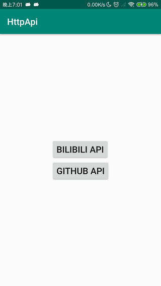

* 点击下方按钮，进入此次作业主页面：

  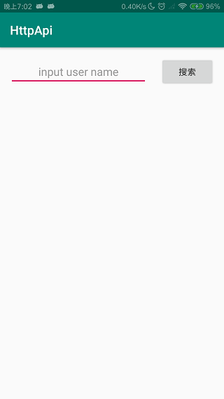

* 输入用户名，网络未连接或者失败情况下弹出提示：

  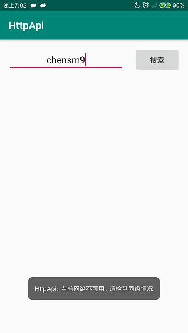

* 输入不存在的用户名弹出提示：

  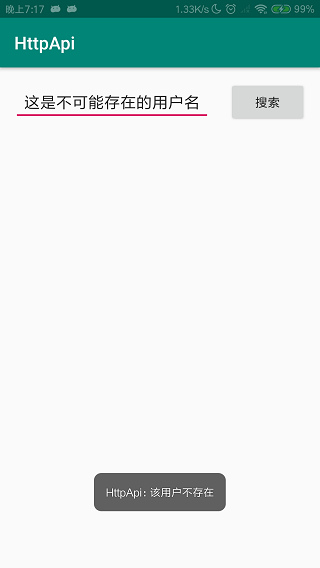

* 输入的用户名对应的用户没有可提交issue的仓库时弹出提示:

  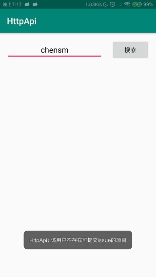

* 输入的用户有可提交issue的仓库，显示出来：
  <table>
    <tr>
        <td>
            <p> 加载数据中显示提示 </p>
            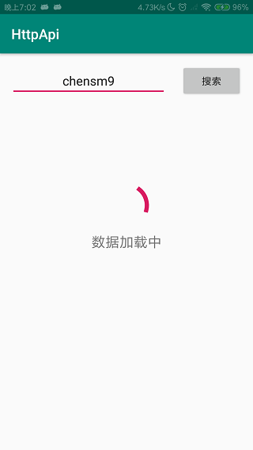
        </td>
        <td>
            <p> 数据成功进行显示 </p>
            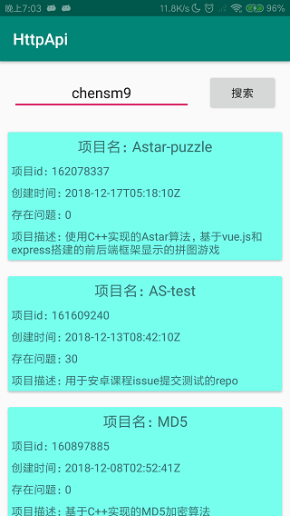
        </td>
    </tr>
  </table>


* 点击某一项仓库进入创建和查看issue界面：
  <table>
    <tr>
        <td>
            <p> 当前仓库没有issues弹出提示 </p>
            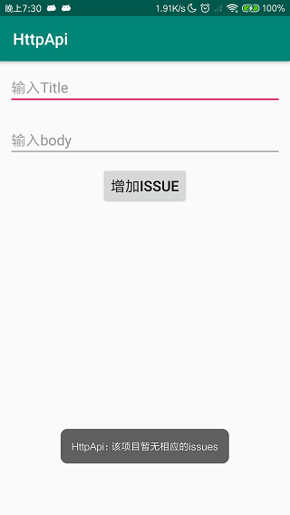
        </td>
        <td>
            <p> 当前仓库有issues进行显示 </p>
            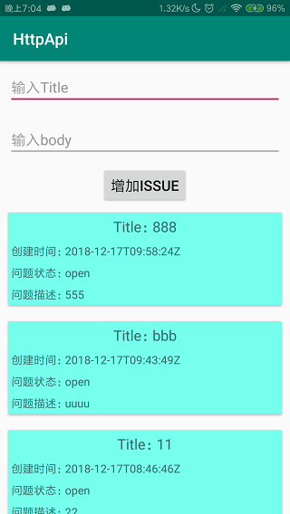
        </td>
    </tr>
  </table>

* 提交issue操作显示：
  <table>
    <tr>
        <td>
            <p>提交issue，界面进入加载数据中 </p>
            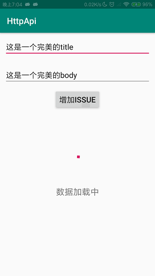
        </td>
        <td>
            <p>提交成功之后， 弹出提示</p>
            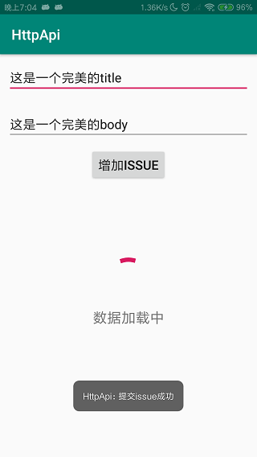
        </td>
        <td>
            <p>获取到新的issue列表，更新显示 </p>
            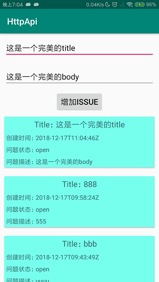
        </td>
    </tr>
  </table>


### (2) 实验步骤以及关键代码
* 首先是我的代码架构，此处，我将上次作业与此次作业进行分文件夹，便于管理，此次作业代码位于Github文件夹中：

    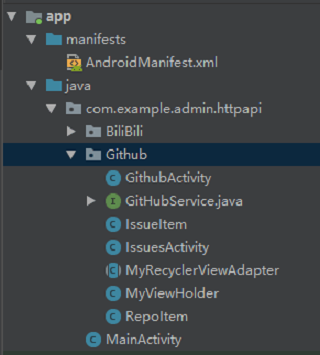

* 首先，因为需要使用rxjava2, okhttp和retrofit等，我们需要在build.gradle中引入相应的包：
  ```java
    implementation 'io.reactivex.rxjava2:rxandroid:2.0.1'
    implementation 'io.reactivex.rxjava2:rxjava:2.1.0'
    implementation 'com.squareup.retrofit2:retrofit:2.0.2'
    implementation 'com.squareup.retrofit2:adapter-rxjava2:2.2.0'
    implementation 'com.squareup.okhttp3:okhttp:3.1.2'
    implementation 'com.squareup.retrofit2:converter-gson:2.1.0'
  ```
* 因为我们此次需要进行网络访问，所以需要给定app相应的权限(这里的user-permission-sdk-23是因为我使用的手机安卓版本问题，需要相应权限)：
  ```xml
    <uses-permission android:name="android.permission.INTERNET"/>
    <uses-permission-sdk-23 android:name="android.permission.INTERNET"/>
    <uses-permission android:name="android.permission.CHANGE_NETWORK_STATE"/>
    <uses-permission-sdk-23 android:name="android.permission.CHANGE_NETWORK_STATE"/>
    <uses-permission android:name="android.permission.ACCESS_NETWORK_STATE"/>
    <uses-permission-sdk-23 android:name="android.permission.ACCESS_NETWORK_STATE"/>
  ```
* 实现主页面（github用户搜索界面）的页面布局文件 github_repo_activity.xml，该页面并不复杂，主要由一个输入框，一个搜索按钮，以及一个RecyclerView组成的，这里我使用线性布局将它们包起来，然后设置RecyclerView的layout_weight为1，实现占据相应剩余布局。同时，在页面获取数据时，我还设置了一个加载条，使用progress_bar实现。
  ```xml
    ···
    <LinearLayout
        android:id="@+id/linear2"
        android:orientation="vertical"
        android:layout_marginTop="100dp"
        android:visibility="gone"
        android:layout_width="match_parent"
        android:layout_height="wrap_content">
        <ProgressBar
            android:id="@+id/progress_bar"
            style="?android:attr/progressBarStyleLarge"
            android:layout_gravity="center_horizontal"
            android:layout_width="match_parent"
            android:layout_height="wrap_content"
            android:scaleType="centerCrop"
            android:adjustViewBounds="true"/>
        <TextView
            android:id="@+id/tip"
            android:text="数据加载中"
            android:textSize="20dp"
            android:textAlignment="center"
            android:layout_width="match_parent"
            android:layout_height="wrap_content" />
    </LinearLayout>
    ···
    <android.support.v7.widget.RecyclerView
        android:id="@+id/recyclerView"
        android:layout_weight="1"
        android:layout_width="match_parent"
        android:layout_height="wrap_content"/>
    ···
  ```
* 实现主页面RecyclerView的item的布局，这里使用了CardView，以下给出内容简介部分的CardView实现部分：
  ```xml
    ···
    <android.support.v7.widget.CardView
        android:layout_margin="5dp"
        app:cardBackgroundColor="#FCFCFC"
        android:layout_width="match_parent"
        android:layout_height="wrap_content">
        <LinearLayout
            android:padding="5dp"
            android:layout_width="match_parent"
            android:layout_height="wrap_content">
            ···
        </LinearLayout>
    </android.support.v7.widget.CardView>
    ···
  ```
* issue界面布局以及item布局与上面repo的布局是相似的，此处不作赘述。

* 接下来是代码实现部分，首先我们分别实现了两个数据类：RepoItem、IssueItem。用来存放发送请求获取的数据。
  ```java
    public class RepoItem {
        private String name;
        private int id;
        private String description;
        private Boolean has_issues;
        private String created_at;
        private int open_issues;
        private OWNER owner;
        private class OWNER {
            public String login;  // 该repo所属用户
        }
        // 省略相关get、set函数
        ...
    }

    public class IssueItem {
        private String title;
        private String created_at;
        private String state;
        private String body;
        // 省略相关get、set函数
        ...
    }
  ```

* 然后，我们需要实现RecyclerView的适配器类MyRecyclerViewAdapter，同时还需要实现一个item的ViewHolder，该部分实现可复用与两个页面，在上周项目我们实现过，较为简单，此处不进行赘述。
* 在GithubActivity.java中，我们需要绑定该RecyclerView和其适配器，同时，重写适配器的convert函数，以及实现RecyclerView条目的点击函数（进行页面跳转）:
  ```java
    private final MyRecyclerViewAdapter myRecyclerViewAdapter = new MyRecyclerViewAdapter<RepoItem>(GithubActivity.this, R.layout.github_repo_item, new ArrayList<RepoItem>()){
        @Override
        public void convert(MyViewHolder holder, RepoItem repo_item) {
            ((TextView)holder.getView(R.id.repo_name)).setText("项目名：" + repo_item.getName());
            ((TextView)holder.getView(R.id.repo_id)).setText("项目id：" + repo_item.getId());
            ((TextView)holder.getView(R.id.create_at)).setText("创建时间：" + repo_item.getCreated_at());
            ((TextView)holder.getView(R.id.issue_num)).setText("存在问题：" + repo_item.getOpen_issues());
            ((TextView)holder.getView(R.id.description)).setText("项目描述：" + repo_item.getDescription());
        }
    };

    public void Init() {
        RecyclerView recyclerView = findViewById(R.id.recyclerView);
        recyclerView.setLayoutManager(new LinearLayoutManager(this));
        recyclerView.setAdapter(myRecyclerViewAdapter);

        myRecyclerViewAdapter.setOnItemClickListener(new MyRecyclerViewAdapter.OnItemClickListener() {
            @Override
            public void onClick(int i) {
                Intent intent = new Intent(GithubActivity.this, IssuesActivity.class);
                Bundle bundle = new Bundle();
                RepoItem item = (RepoItem)myRecyclerViewAdapter.getItem(i);
                bundle.putSerializable("repo_name", item.getName());
                bundle.putSerializable("user_name", item.getUserName());
                intent.putExtras(bundle);
                startActivity(intent);
            }

            @Override
            public void onLongClick(int position) {

            }
        });
    }
  ```
* 在IssueActivity.java中，我们也需要绑定该RecyclerView和其适配器，同时，重写适配器的convert函数：
  ```java
    private final MyRecyclerViewAdapter myRecyclerViewAdapter =
            new MyRecyclerViewAdapter<IssueItem>(IssuesActivity.this, R.layout.github_issue_item, new ArrayList<IssueItem>()){
        @Override
        public void convert(MyViewHolder holder, IssueItem issue_item) {
            ((TextView)holder.getView(R.id.issue_title)).setText("Title：" + issue_item.getTitle());
            ((TextView)holder.getView(R.id.created_at)).setText("创建时间：" + issue_item.getCreated_at());
            ((TextView)holder.getView(R.id.issue_state)).setText("问题状态：" + issue_item.getState());
            ((TextView)holder.getView(R.id.issue_body)).setText("问题描述：" + issue_item.getBody());
        }
    };

    protected void InitRecyclerView() {
        RecyclerView recyclerView = findViewById(R.id.recyclerView);
        recyclerView.setLayoutManager(new LinearLayoutManager(this));
        recyclerView.setAdapter(myRecyclerViewAdapter);
    }
  ```
* 而后，我们需要实现Interface为API访问接口，用于retrofit发送相应请求的借口，此处post请求需要相应token，我们在其Headers进行指定。而这里我们接口函数返回的都是一个Observable对象：
  ```java
  public interface GitHubService {
    @Headers({
            "Authorization: token  You can't see me"
    })
    @GET("/users/{user_name}/repos")
    Observable<List<RepoItem>> getRepo(@Path("user_name") String user_name);

    @Headers({
        "Authorization: token You can't see me"
    })
    @GET("/repos/{user_name}/{repo_name}/issues")
    Observable<List<IssueItem>> getIssue(@Path("user_name") String user_name,
                                   @Path("repo_name") String repo_name);

    @Headers("Authorization: token  You can't see me")
    @POST("/repos/{user_name}/{repo_name}/issues")
    Observable<IssueItem> postIssue(@Path("user_name") String user_name,
                                    @Path("repo_name") String repo_name,
                                    @Body RequestBody postMessage);
    }
  ```
* 此处我们还需要实现一个类用以产生进行post时的请求json数据，该类实现较为简单（因为提交issues时只需要title和body）：
  ```java
  class PostMessage{
    private String title;
    private String body;
    public PostMessage(String title, String body) {
        this.title = title;
        this.body = body;
   }
  ```
* 然后，我们需要判断网络是否有效，依赖ConnectivityManager，此处实现较为简单：
  ```java
    public boolean isNetworkAvailable() {
        ConnectivityManager connectivityManager = (ConnectivityManager) GithubActivity.this
                .getSystemService(Context.CONNECTIVITY_SERVICE);
        NetworkInfo networkInfo = connectivityManager.getActiveNetworkInfo();
        return networkInfo != null && networkInfo.isConnected();
    }
  ```
* GithubActivity.java界面搜索按钮的点击函数如下， 首先判断当前网络是否有效，然后创建一个retrofit对象, 利用上面写的接口类，获取相应的Observable对象，订阅返回响应并更新UI，同时该过程还需要注意加载条与列表的Visibility的切换（提供更好的用户交互）：
  ```java
      public void SearchRepoOnClick(View target) {
        if (!isNetworkAvailable()) {
            Toast.makeText(GithubActivity.this, "当前网络不可用，请检查网络情况", Toast.LENGTH_SHORT).show();
            return;
        }
        String username = ((EditText)findViewById(R.id.input)).getText().toString();
        findViewById(R.id.recyclerView).setVisibility(View.GONE);
        findViewById(R.id.linear2).setVisibility(View.VISIBLE);
        OkHttpClient build = new OkHttpClient.Builder()
                .connectTimeout(2, TimeUnit.SECONDS)
                .readTimeout(2, TimeUnit.SECONDS)
                .writeTimeout(2, TimeUnit.SECONDS)
                .build();
        Retrofit retrofit = new Retrofit.Builder()
                .baseUrl(BASE_URL) //设置网络请求的Url地址
                .addConverterFactory(GsonConverterFactory.create()) //设置数据解析器
                .addCallAdapterFactory(RxJava2CallAdapterFactory.create())
                .client(build)
                .build();
        GitHubService request = retrofit.create(GitHubService.class);
        request.getRepo(username)
                .subscribeOn(Schedulers.io())
                .observeOn(AndroidSchedulers.mainThread())
                .subscribe(new Observer<List<RepoItem>>() {
                       @Override
                       public void onSubscribe(Disposable d) {

                       }

                       @Override
                       public void onNext(List<RepoItem> list) {
                           list.removeIf(new Predicate<RepoItem>() {
                               @Override
                               public boolean test(RepoItem repoItem) {
                                   return !repoItem.getHas_issues();
                               }
                           });
                           // 按照创建日期排序
                           list.sort(new Comparator<RepoItem>() {
                               @Override
                               public int compare(RepoItem o1, RepoItem o2) {
                                   return o2.getCreated_at().compareTo(o1.getCreated_at());
                               }
                           });
                           myRecyclerViewAdapter.refresh(list);
                           if (list.size() == 0) {
                               Toast.makeText(GithubActivity.this,
                                       "该用户不存在可提交issue的项目", Toast.LENGTH_SHORT).show();
                           }
                       }

                       @Override
                       public void onError(Throwable e) {
                           List<RepoItem> list = new ArrayList<>();
                           myRecyclerViewAdapter.refresh(list);
                           Toast.makeText(GithubActivity.this,
                                   "该用户不存在", Toast.LENGTH_SHORT).show();
                           findViewById(R.id.recyclerView).setVisibility(View.VISIBLE);
                           findViewById(R.id.linear2).setVisibility(View.GONE);
                       }

                       @Override
                       public void onComplete() {
                           findViewById(R.id.recyclerView).setVisibility(View.VISIBLE);
                           findViewById(R.id.linear2).setVisibility(View.GONE);
                       }
                   });
    }
  ```
* 相同的，在IssueActivity界面，我们也进行跟上述函数差不多的实现，实现获取所有Issues的函数以及提交相应Issue的函数的实现：
  ```java
      public void getAllIssues() {
        if (!isNetworkAvailable()) {
            Toast.makeText(IssuesActivity.this, "当前网络不可用，请检查网络情况", Toast.LENGTH_SHORT).show();
            return;
        }
        findViewById(R.id.recyclerView).setVisibility(View.GONE);
        findViewById(R.id.linear2).setVisibility(View.VISIBLE);
        try {
            OkHttpClient build = new OkHttpClient.Builder()
                    .connectTimeout(2, TimeUnit.SECONDS)
                    .readTimeout(2, TimeUnit.SECONDS)
                    .writeTimeout(2, TimeUnit.SECONDS)
                    .build();
            Retrofit retrofit = new Retrofit.Builder()
                    .baseUrl(BASE_URL) //设置网络请求的Url地址
                    .addConverterFactory(GsonConverterFactory.create()) //设置数据解析器
                    .addCallAdapterFactory(RxJava2CallAdapterFactory.create())
                    .client(build)
                    .build();
            GitHubService request = retrofit.create(GitHubService.class);
            request.getIssue(user_name, repo_name)
                    .observeOn(AndroidSchedulers.mainThread())
                    .subscribeOn(Schedulers.io())
                    .subscribe(new Observer<List<IssueItem>>() {
                        @Override
                        public void onSubscribe(Disposable d) {

                        }

                        @Override
                        public void onNext(List<IssueItem> list) {
                            // 按照创建日期排序
                            list.sort(new Comparator<IssueItem>() {
                                @Override
                                public int compare(IssueItem o1, IssueItem o2) {
                                    return o2.getCreated_at().compareTo(o1.getCreated_at());
                                }
                            });
                            myRecyclerViewAdapter.refresh(list);
                            if (list.size() == 0) {
                                Toast.makeText(IssuesActivity.this,
                                        "该项目暂无相应的issues", Toast.LENGTH_SHORT).show();
                            }
                        }

                        @Override
                        public void onError(Throwable e) {
                            List<IssueItem> list = new ArrayList<>();
                            myRecyclerViewAdapter.refresh(list);
                            Toast.makeText(IssuesActivity.this,
                                    e.getMessage(), Toast.LENGTH_SHORT).show();
                        }

                        @Override
                        public void onComplete() {
                            findViewById(R.id.recyclerView).setVisibility(View.VISIBLE);
                            findViewById(R.id.linear2).setVisibility(View.GONE);
                        }
                    });
        }catch (Exception e) {
            e.printStackTrace();
        }
    }

    public void AddIssuesOnClick(View target) {
        if (!isNetworkAvailable()) {
            Toast.makeText(IssuesActivity.this, "当前网络不可用，请检查网络情况", Toast.LENGTH_SHORT).show();
            return;
        }
        findViewById(R.id.recyclerView).setVisibility(View.GONE);
        findViewById(R.id.linear2).setVisibility(View.VISIBLE);
        final String title = ((EditText)findViewById(R.id.issue_title_input)).getText().toString();
        final String body = ((EditText)findViewById(R.id.issue_body_input)).getText().toString();
        try {
            OkHttpClient build = new OkHttpClient.Builder()
                    .connectTimeout(2, TimeUnit.SECONDS)
                    .readTimeout(2, TimeUnit.SECONDS)
                    .writeTimeout(2, TimeUnit.SECONDS)
                    .build();
            Retrofit retrofit = new Retrofit.Builder()
                    .baseUrl(BASE_URL) //设置网络请求的Url地址
                    .addConverterFactory(GsonConverterFactory.create()) //设置数据解析器
                    .addCallAdapterFactory(RxJava2CallAdapterFactory.create())
                    .client(build)
                    .build();
            String message = new Gson().toJson(new PostMessage(title, body));
            RequestBody req_body = RequestBody.create(okhttp3.MediaType.parse("application/json;charset=utf-8"), message);
            GitHubService request = retrofit.create(GitHubService.class);
            request.postIssue(user_name, repo_name, req_body)
                    .observeOn(AndroidSchedulers.mainThread())
                    .subscribeOn(Schedulers.io())
                    .subscribe(new Observer<IssueItem>() {
                        @Override
                        public void onSubscribe(Disposable d) {

                        }

                        @Override
                        public void onNext(IssueItem issueItem) {
                            Toast.makeText(IssuesActivity.this, "提交issue成功", Toast.LENGTH_SHORT).show();
                        }

                        @Override
                        public void onError(Throwable e) {
                            Toast.makeText(IssuesActivity.this, "提交issues失败："+e.getMessage(), Toast.LENGTH_SHORT).show();
                            findViewById(R.id.recyclerView).setVisibility(View.VISIBLE);
                            findViewById(R.id.linear2).setVisibility(View.GONE);
                        }

                        @Override
                        public void onComplete() {
                            getAllIssues();
                        }
                    });
        } catch (Exception e) {
            e.printStackTrace();
        }
    }
  ```

### (3) 实验遇到的困难以及解决思路
#### 问题一：在完成加分项时，发现每次发送post请求之后，返回的状态码不是201，而是200，同时返回了所有的issue信息，跟get请求返回结果相同。
解决：最开始我以为是自己代码的问题，调用错函数，但是查看了一下并没有调用错，而后使用postman进行测试发包，发现当url是HTTPS协议时，可以成功创建issue，并返回该issue的信息，而使用HTTP协议时，post请求就变成get请求了。可能是github的api设计上的一些问题吧。
#### 问题二：使用retrofit发送请求时，总会有以下相应的报错：
```
java.lang.IllegalArgumentException: Could not locate call adapter for rx.Observable
```
解决：经过上网查询以及报错信息猜测，要在构建Retrofit时指定适配器模式为RxJavaCallAdapterFactory，实现代码如下：
  ```java
  Retrofit retrofit = new Retrofit.Builder()
        .baseUrl(BASE_URL) //设置网络请求的Url地址
        .addConverterFactory(GsonConverterFactory.create()) 
        .addCallAdapterFactory(RxJava2CallAdapterFactory.create()) // 指定适配器
        .client(build)
        .build();
  ```
还有一点是，RxJava2CallAdapterFactory需要引入相应的依赖才能使用：
```
implementation 'com.squareup.retrofit2:adapter-rxjava2:2.2.0'
```
#### 问题三：进行post请求发送时，总是收到返回的状态码为400。
解决：因为已经按照教程在Header中添加了token，所以推测是数据的问题，使用postman进行测试时，发现如果发送的数据不是json，或者数据不符合要求，都会导致返回结果为400，经过查询，找到了问题所在，原来，在写post的API函数时，我的实现是这样的：
```java
@Headers("Authorization: token")
@POST("/repos/{user_name}/{repo_name}/issues")
Observable<IssueItem> postIssue(@Path("user_name") String user_name,
                                @Path("repo_name") String repo_name,
                                @Field("title") String title,
                                @Field("body") String body);
```
然而github的api要求是发送一个json，所以我这样写是错的，这样写发送的数据是 title=XXX&body=XXX，而不是一个json，要传送json的话，不能使用@Field，而是使用@Body，实现如下：
```java
@Headers("Authorization: token")
@POST("/repos/{user_name}/{repo_name}/issues")
Observable<IssueItem> postIssue(@Path("user_name") String user_name,
                                @Path("repo_name") String repo_name,
                                @Body RequestBody postMessage);
```
这里使用的是@Body关键字，对应参数是一个RequestBody，在调用时，我们需要将json放入这个RequestBody中，这里我们就需要使用到Gson了：
```java
String message = new Gson().toJson(new PostMessage(title, body));
RequestBody req_body = RequestBody.create(okhttp3.MediaType.parse("application/json;charset=utf-8"), message);
GitHubService request = retrofit.create(GitHubService.class);
request.postIssue(user_name, repo_name, req_body)
...
```

---

## 五、实验思考及感想

这周的任务不算特别难，但是会有些许坑，搞懂了就很简单，搞不懂时真是debug一晚上都解决不了，例如这次把https写成了http，很难想到post请求变成get请求的原因竟然是github那边api设计成这样0.0。不过，还是学习到了许多知识，同时还了解了一些发包抓包软件的使用（将手机设置代理，在电脑上用相应的抓包软件捕获手机发出来的包）。经过这次作业，主要有一下一些收获：
1. 了解了一下Restful接口的实现和使用，同时进行实践使用github的Restful接口编写作业代码。
2. 学会使用OkHttp和Retrofit2请求访问Web服务，能够获取相应的数据。
3. 复习使用RxJav，更深刻了解多线程编程的内涵，学会使用线程进行Web服务请求以及更新UI。
4. 复习gson的使用，能够进行简单的JSON数据解析。
5. 复习界面设计布局，温习recyclerView的使用和适配器设置等，同时学习一些新的组件（如CardView）的使用。

---